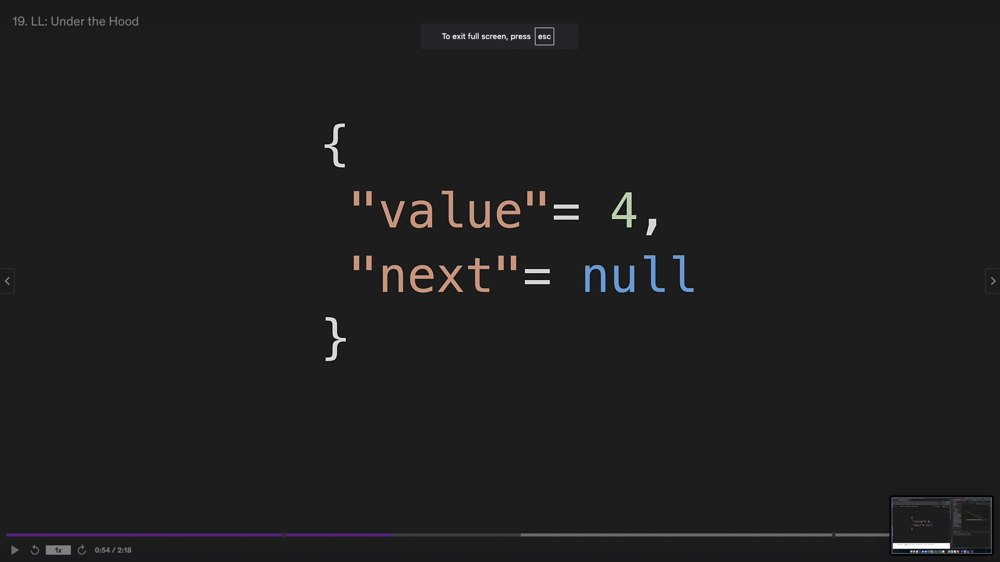
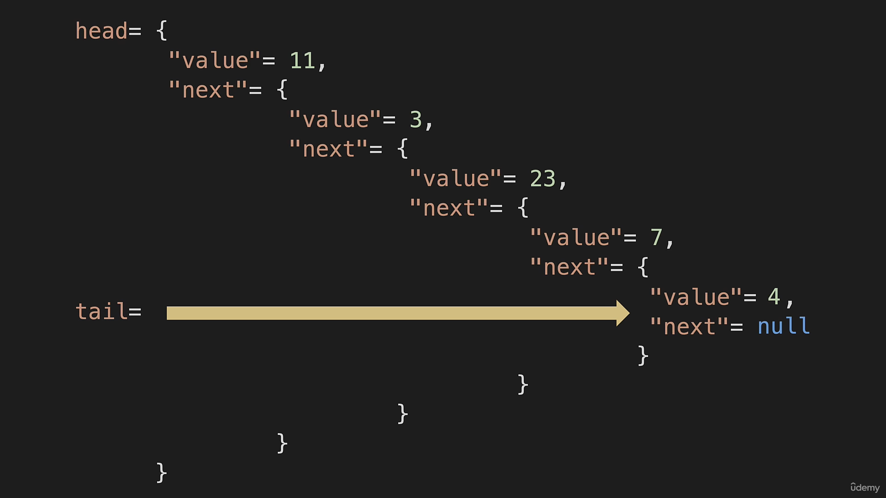

**Linked List Vs ArrayLists**

```
(a)For Linked lists we cannot get elements by the index.
{we do not have indexes where we can go directly to a particular item}

(b)With a linked instead of items being in a contiguous place in memory
they are going to be spread out.

(c)A linked List has a variable called head that points to the first node
and tail that points to the last node.

(d)Each node from the head points to the next node until we reach to the end

(e)The last node has a pointer which points to null meaning it doesnt point to anything.

```
**Linked List Image(s)lin**


**ArrayList Image**


**ArrayList vs Linked List Comparison**


**BigO OF Linked Lists vs ArraytLists**


**What is a Node??**

```
A node is just like a hashMap, it has both a value and a pointer
The pointer of the head points to the next node and the pointer
of the tail, since it is at the end points to null
```

**Node Diagram**



**Nodes in a Linked List**



**Linked List Method**

```
(a)Append adds a new node at the end of the linked list.
   First and foremost append will create a new node.
   if the linked list is empty, then append should create a new node and let the head and the tail 
   point to it.
   
   Else if not empty, i should link the newly created node to the linked list and reassign the tail to the newNode
   {tail.next = newNode && tail = newNode}

```
**Notes By**

```
Mbugua Caleb

```