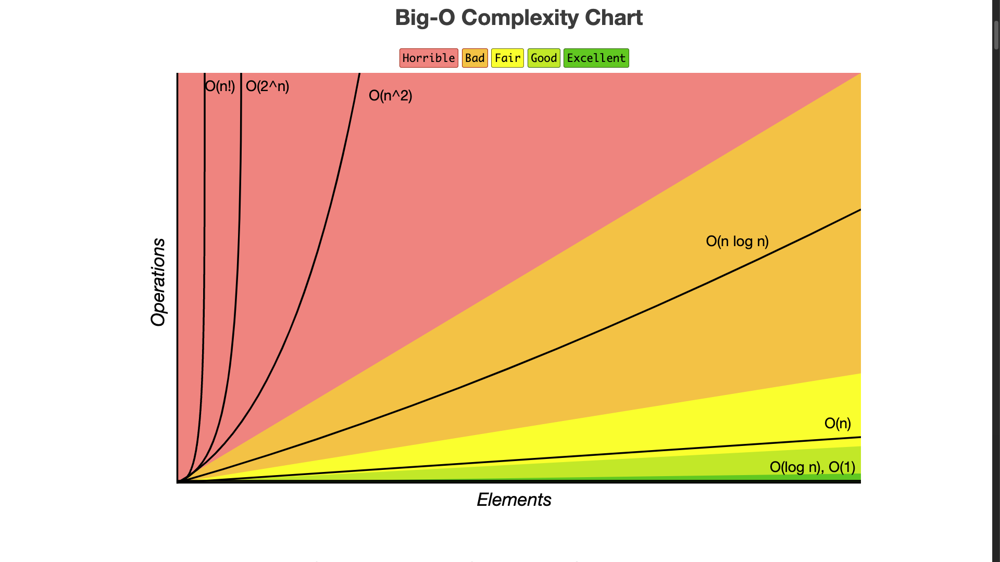
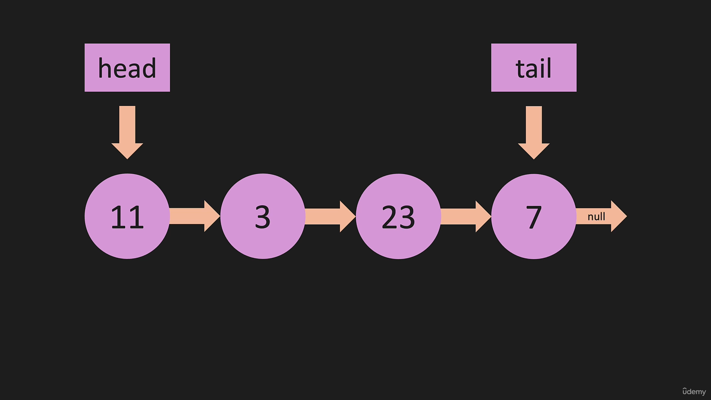
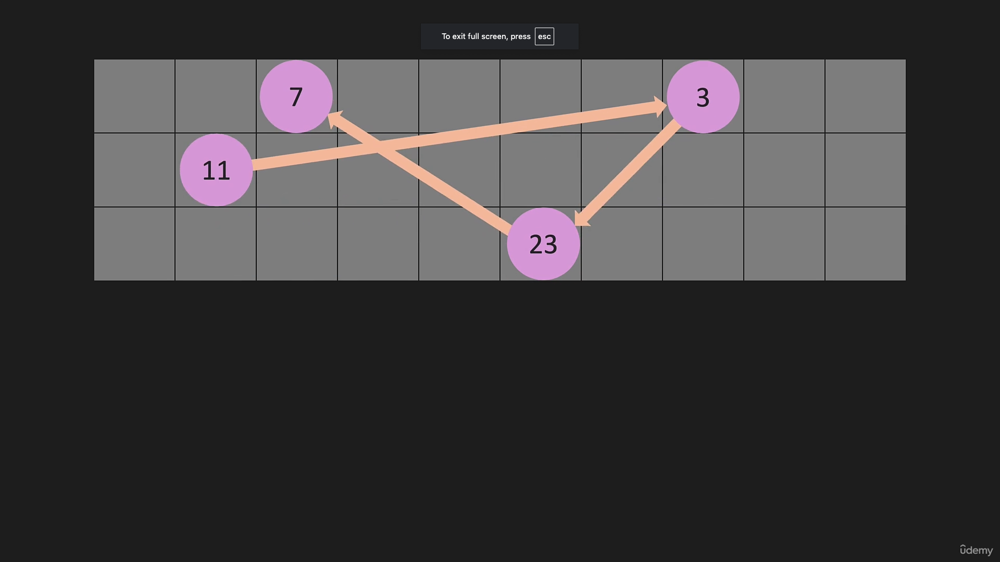
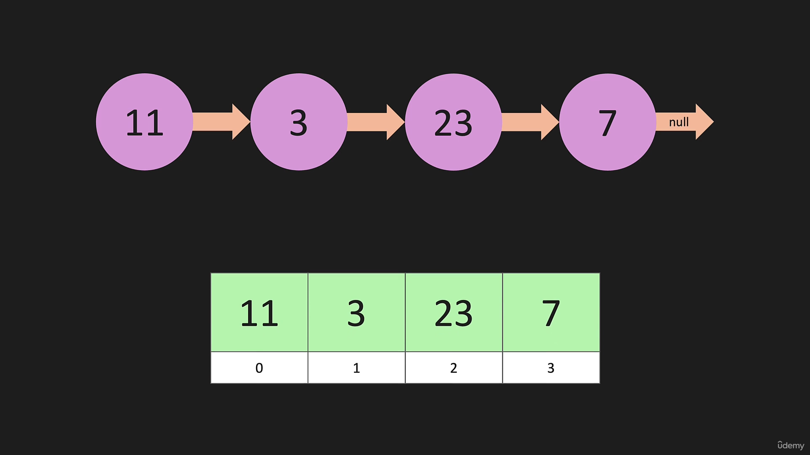
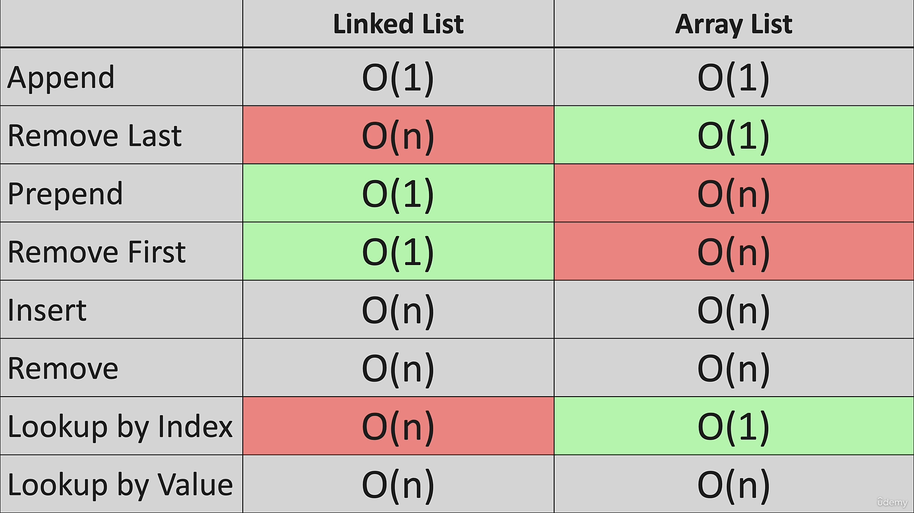

**Linked List Vs ArrayLists**

```
(a)For Linked lists we cannot get elements by the index.
{we do not have indexes where we can go directly to a particular item}

(b)With a linked instead of items being in a contiguous place in memory
they are going to be spread out.

(c)A linked List has a variable called head that points to the first node
and tail that points to the last node.

(d)Each node from the head points to the next node until we reach to the end

(e)The last node has a pointer which points to null meaning it doesnt point to anything.

```
**Linked List Image(s)lin**



**ArrayList Image**


**ArrayList vs Linked List Comparison**


**BigO OF Linked Lists vs ArraytLists**




**What is a Node??**

```
A node is just like a hashMap, most 
```
**Notes By**

```
Mbugua Caleb

```